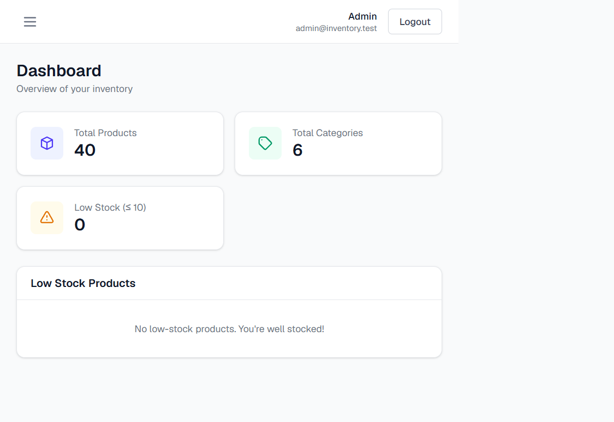
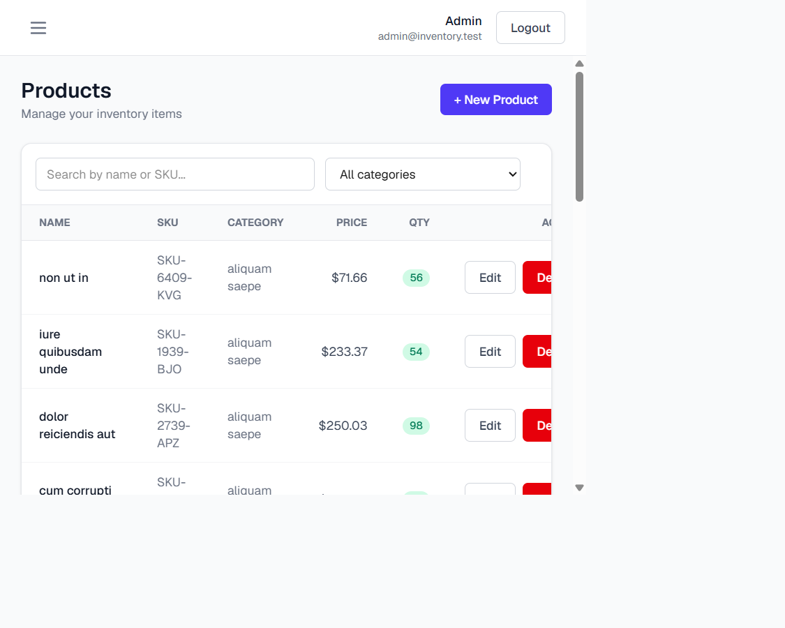
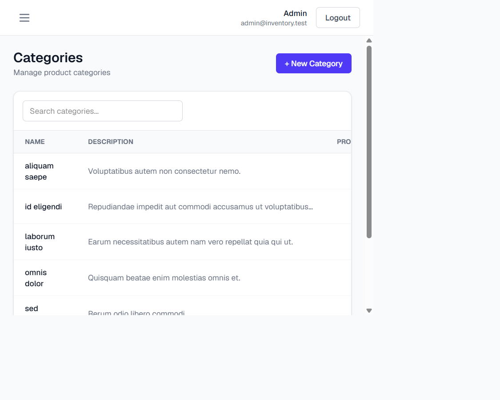
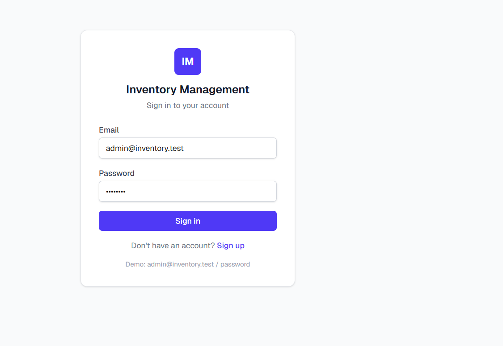

# Inventory Management System

A full-stack Inventory Management System with a **Laravel 12** REST API backend and a **Next.js 15** frontend.


## Screenshots

| Dashboard | Products |
|-----------|----------|
|  |  |

| Categories | Login |
|------------|-------|
|  |  |

## Tech Stack

**Backend**
- Laravel 12 (PHP 8.2+)
- PostgreSQL
- Laravel Sanctum (token auth)
- Eloquent ORM, Form Requests, API Resources

**Frontend**
- Next.js 15 (App Router) + TypeScript
- Tailwind CSS
- Axios
- TanStack Query
- React Hook Form

## Features
- **Authentication** — register, login, logout with Laravel Sanctum tokens; protected API routes
- **Per-user data isolation** — each user only sees and manages their own categories and products (enforced server-side)
- **Dashboard** — total products, total categories, low-stock products
- **Categories** — full CRUD + search
- **Products** — full CRUD + search, category filter, pagination
- **Responsive UI** — sidebar, navbar, tables, modals, confirmation dialogs, loading/error/empty states

## Project Structure
```
.
├── backend/    # Laravel 12 REST API
└── frontend/   # Next.js 15 app
```

## Getting Started

### Prerequisites
- PHP 8.2+, Composer
- PostgreSQL
- Node.js 18+

### Backend
```bash
cd backend
composer install
cp .env.example .env
php artisan key:generate
# configure PostgreSQL credentials in .env, then:
php artisan migrate --seed
php artisan serve --port=8000
```

Default login (from the seeder): `admin@inventory.test` / `password`

### Frontend
```bash
cd frontend
npm install
# create .env.local with:
#   NEXT_PUBLIC_API_URL=http://127.0.0.1:8000/api
npm run dev
```

Open http://localhost:3000

## API Endpoints
| Method | Endpoint | Description |
|--------|----------|-------------|
| POST | `/api/register` | Create an account, returns a token |
| POST | `/api/login` | Authenticate, returns a token |
| POST | `/api/logout` | Revoke current token |
| GET | `/api/me` | Current authenticated user |
| GET | `/api/dashboard` | Dashboard statistics |
| GET/POST | `/api/categories` | List / create categories |
| GET/PUT/DELETE | `/api/categories/{id}` | Show / update / delete category |
| GET/POST | `/api/products` | List / create products |
| GET/PUT/DELETE | `/api/products/{id}` | Show / update / delete product |

All routes except `/api/register` and `/api/login` require a `Bearer` token.
